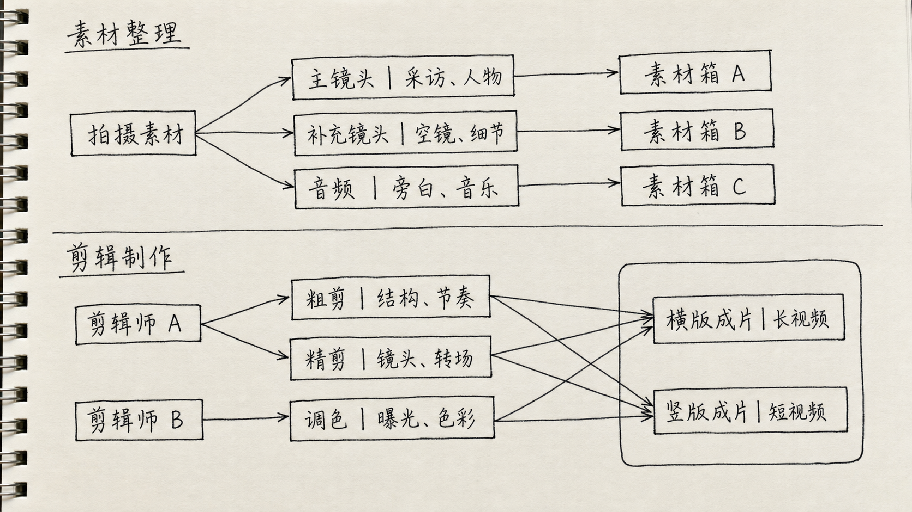
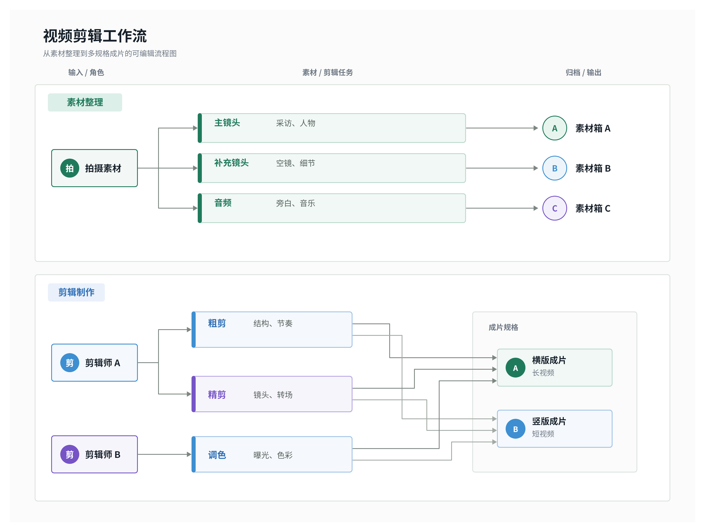

# Hand-drawn to Editable Diagram Skill

Turn a photo or scan of a hand-drawn diagram into a clean, logically faithful, editable professional diagram.

The skill supports two modes:

- **Faithful redraw** — reproduce the visible structure without inventing missing business logic. Visual elements can be adjusted after generation: shapes, text, connectors, etc. Export targets include Feishu/Lark whiteboards, Figma, PowerPoint, and offline editable SVG files.
- **Intent enhanced** — ask for the central idea and intended audience takeaway, then combine those answers with the sketch to improve communication.

Outputs can target editable SVG, Feishu/Lark whiteboards, Figma/FigJam, or PowerPoint when the host AI environment provides the corresponding write capability and user authorization.

## Install

Copy `handdrawn-to-editable-diagram/` into the skills directory used by your AI agent. For Codex:

```bash
cp -R handdrawn-to-editable-diagram "${CODEX_HOME:-$HOME/.codex}/skills/"
```

Then ask the agent:

> Use $handdrawn-to-editable-diagram to turn this sketch into an editable professional diagram. Check only the dependencies needed for my chosen destination. If the destination cannot be written from this environment, fall back to editable SVG.

## Platform support

| Environment | Understand sketch | Editable SVG | Feishu write | Figma write |
|---|---:|---:|---:|---:|
| Codex with connectors/tools | Yes | Yes | With Feishu CLI + auth | With Figma connector + auth |
| Claude Code / Cursor / local agent | Yes | Yes | After CLI/MCP setup | After MCP/plugin setup |
| Restricted browser chat | Usually | Source only | No | No |
| Custom application | Yes | Yes | Via authenticated adapter | Via authenticated adapter |

The skill never embeds personal document tokens or bypasses account authorization. See `handdrawn-to-editable-diagram/capabilities.yaml` and `references/requirements.md` for machine-readable and human-readable requirements.

## Reference example

<table>
  <tr>
    <th width="50%">Input: hand-drawn sketch</th>
    <th width="50%">Output: editable SVG (rendered preview)</th>
  </tr>
  <tr>
    <td width="50%" align="center">
      
    </td>
    <td width="50%" align="center">
      <a href="examples/video-editing-workflow/editable-diagram.svg">
        
      </a>
    </td>
  </tr>
</table>

Click the Output preview to open the actual [`editable-diagram.svg`](examples/video-editing-workflow/editable-diagram.svg).

## License

MIT
